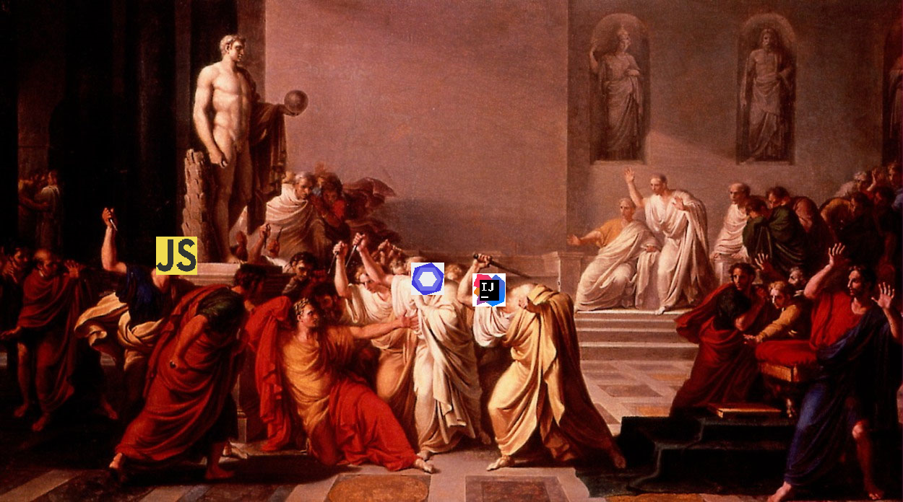

# Experience is the Teacher of All Things 

On the surface coding standards do seem a bit trivial. What difference does it make that there are 4 spaces as opposed to two? Is it necessary to use single quotes as opposed to double quotes? At first I was slightly annoyed by the prospect that I would be unable to submit my code without following some arbitrary standard. However after noticing the difference in the style of my code I have taken a different outlook on what coding standards really do.  

From a linguistic perspective, every language and culture has certain ideas or customs that they put a great emphasis on. For example in Thailand there are a dozen words to say smile, each with a very different meaning.  Bringing this back to the realm of programming, in the same way that cultures emphasize different aspects of their daily lives or the world around them; coding standards show what different programming languages emphasize. While I have not used strict coding standards in any other language (only suggested guidelines), even my sojourn within JavaScript coding standards has taught me where to emphasize and de-emphasize certain aspects of the  language. For example one of the errors I came across today within our ESLint standards was that string concatenation was disallowed. I found this to be very interesting as it is such a common practice within Java. This is where I feel coding standards come into play. While very similar, Java is not JavaScript. Small minute differences like this really add up and change the way that you think about programming in different languages. This is something that I really like about coding standards. Just as learning different languages teaches you different ways to describe the world around you, practicing different coding standards teaches us different ways to think about programming and where different languages may be more effective than others. 

# Et Tu, IntelliJ? 

Previously, our class has been coding in a cloud based programming environment known as JSFiddle. Within JSFiddle I had a lot of complaints about the environment, primarily about the way the error messages were displayed. Having an error message that lets you know there is a missing delimiter somewhere in your code, but not the exact location is an absolute nightmare. Having to look through every line without a general idea of where to look is time consuming. This being said when we were told do download a JavaScript IDE I jumped at the opportunity, I then downloaded a program known as IntelliJ. After watching a short tutorial on how to configure everything I was feeling great. When I missed a parenthesis the IDE was quick to inform me of my mistake. I installed the coding style package of ESLint which corrected my stylistic errors, which were annoying at first, but after sometime I started to get used to. 

Then why the pessimistic title of this subsection and the overall essay? During my timed programming assignment this Thursday I was stabbed in the back by ESLint and IntelliJ. The code we were required to do was simple enough. Given an array of strings, return a new array with the length of the element added onto the end of the element. Took me a bit longer than I wanted to because ESLint does not approve of string concatenation, so I had to play around with using the template format of JavaScript, not a big deal. I was almost done with one error left so I committed to GitHub. I scroll over the error to find "_ is not defined", seemed harmless enough with 8 minutes remaining I could easily troubleshoot this. Running through all the possibilities I checked my .html file to be sure I included the underscore library, included. Strange, next step, is my ESLint working? Yes. 7 minutes left. Maybe someone else has had this error? After opening countless troubleshooting tabs I hear the dreaded "One minute remaining". I felt that I would definitely get a zero on this assignment, despite completing 99% of the problem. After time had expired and going over the problem with Professor Johnson, the error I was having seemed to be a rare exception. The problem was fixed by simply restarting IntelliJ several times. Something I should have tried to 7 minutes ago. Luckily, since this was such a rare case and I had the foresight to commit when I finished coding I was able to receive full credit. Not such a tragedy after all. 

