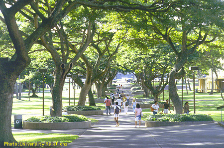

During my Junior year I was accepted into the ACE Peer Mentoring program. This program enabled upper classmen to mentor incoming freshman on the necessary skills needed to succeed in college. For the freshman this was a useful program that allowed them to learn how to connect with peers, create study groups, learn better time management, among many other helpful techniques. For the peer mentors this experience taught leadership, organizational skills, and an insight into teaching. 
 
 
Each week I would meet with my class of 12 students to go over any questions or problems that had happened during the week. The topics were direct questions about subject material or anything outside the classroom. We would then discuss the subject matter to help guide the best approach. This helped many students not only maintain high grades in their classes, but helped assuage the overall stress that comes being a first year student at a large university. Part of the requirements of being a peer mentor was to demonstrate organizational skills. This was done by holding events outside of school with our students in order to build rapport between the class. In addition to these outings, peer mentors were required to organize a fundraising event, and a community service event with the class.   

Program Website: http://manoa.hawaii.edu/undergrad/freshman/peer-mentors/
