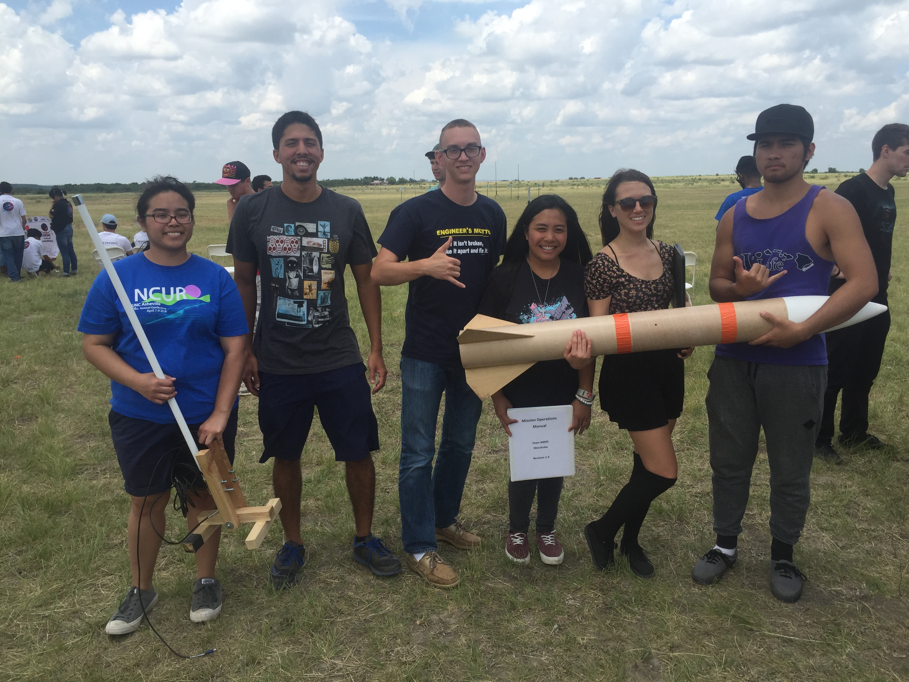

 

The NASA CANSAT competition is a yearly competition sponsored by NASA in which teams must follow a specific set of instructions to create a system within the specified requirements. For this project year, we were to create a canister that would hold a glider. Upon deployment, the glider would descend in a helical pattern while collecting atmospheric data such as temperature, GPS coordinates, atmospheric pressure, altitude, among many others. The system could not exceed 500g, and was required to fit in a rocket approximately 10 inches in diameter. The competition was held with many teams presenting their designs, then narrowed down to 40 teams that would be flown out to Texas for the competition. 

My role for this project was mechanical engineering team lead. One of the major limitations of the project was the very low weight requirement and the size requirement of the rocket. I was responsible for working with a team of two other mechanical engineers to find a material strong enough to withstand the rocket's acceleration, while light enough to fit the weight requirement. Eventually a carbon fiber PLA filament was found to be the best material in terms of its strength to weight ratio. Another challenge faced by the mechanical engineering team was to find the correct shape to have maximum aerodynamic capabilities, while being able to hold all the required electronics from the electrical engineering team. Our team eventually placed 13th out of 40 teams.

From this project I learned the engineering process. Our team had an initial design that originated through research and what we conceptualized to be the best idea possible. From there we created a presentation with our initial design and presented it to a panel of NASA judges. The judges then offered critiques and suggestions for improving our design. After the improvements testing finally began and many more changes occured. The new tested design went through the judging process again before being approved. To see something go through the entire process was a very powerful experience and illustrated expectation vs. reality. 

Competition Website: http://www.cansatcompetition.com/

