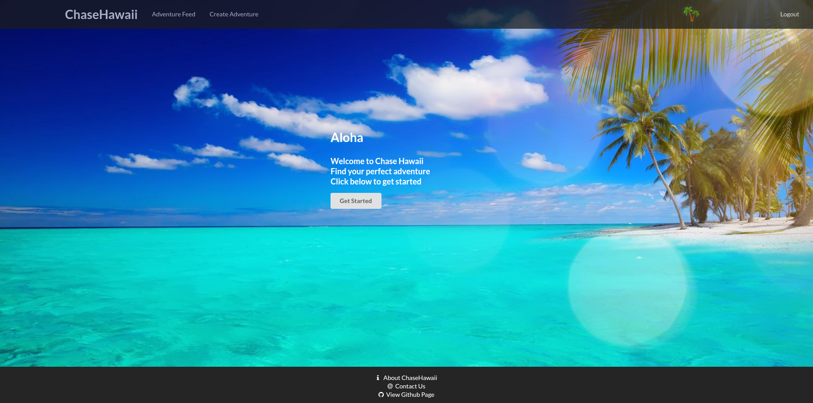
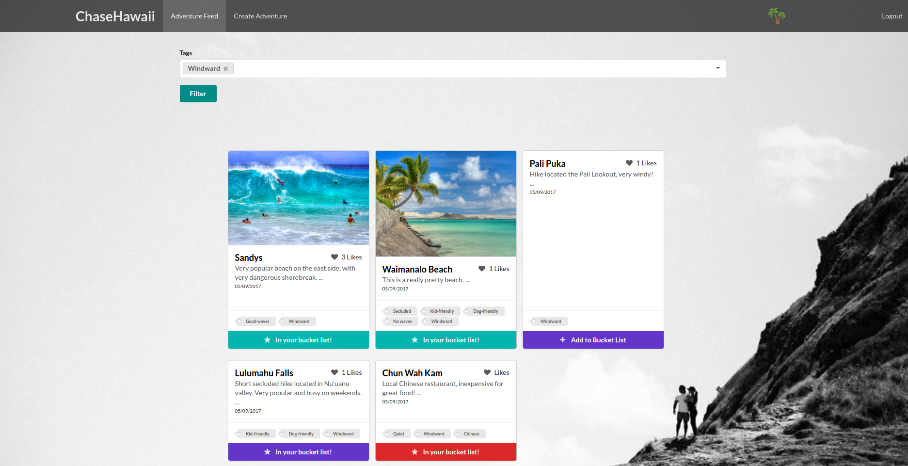
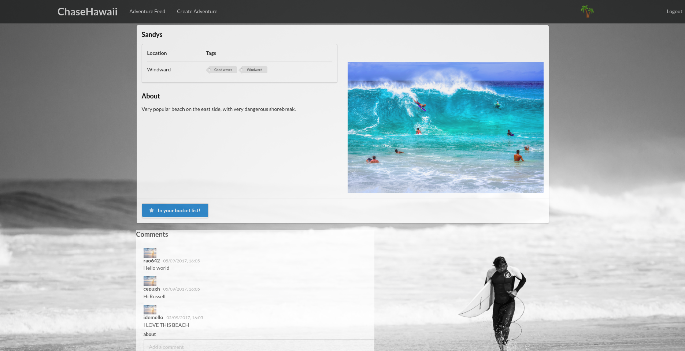

For our final project in ICS 314 we were tasked with creating a fully functional web application applying all the principles we had learned throughout the semester. This at first seemed overwhelming, but once I got into the project I realized that overwhelming was a massive understatement. Applying all the principles you've learned over a very quickly paced course adds up rapidly. Especially because I had not worked with any of the languages involved in the project until this semester, nor had I ever used a framework. Combining the elements of git, JavaScript, meteor, CSS, HTML, IDPM, and even more elements did not even scratch the surface of the requisite knowledge required for this project. Chase Hawaii quickly became a sink or swim scenario, so I did my best to do the latter.  
  
Initially the project did seem fairly simple. For the first task we were only required to create a mockup web page consisting only of CSS and HTML. This did not take long, and the end result was moderately appealing, though rough around the edges. The next segment of the project proved to be much more challenging. This is where we had to integrate JavaScript into our project, more accurately where we had to integrate Meteor into our project. This is where I realized that I was not nearly as good at Meteor as I thought I had been. I was constantly getting lost within our project and breaking things with small changes. It was at this point that I realized that I needed to find a way to contribute in order to move the project forward. I spent many hours re-watching tutorial videos, both from what we learned in class, and what was available on the web. It was only then that I was able to understand the how Meteor on a satisfactory level. However, by the time our project was over I felt competent in meteor. I am nowhere near mastering the framework, but I would be comfortable talking about Meteor's pros and cons.  
  
I feel that our project turned out very well. The core idea of our project was to create a web app that allowed University of Hawaii students to find adventures on the island that best fit them. Whether these adventures were beaches they had never been to, hikes they have yet to attempt, or simply restaurants that they were interested in trying. We aimed to give them an easy-to-navigate webpage that allowed students to find these adventures. On a cursory level users were able to create their own profile, create adventures they had done, choose which adventures they wanted to do next, "like" particular adventures, comment on each one, and view other profiles. Once an adventure was created an admin would approve or deny what the user had created. This was implemented to provide better control over what other users saw, but especially to deter duplicate or inappropriate posts.  

  
My role in this project was primarily centered around the aesthetics of the website. I was tasked with making sure that the different pages of the website flowed together smoothly and were visually appealing to the users of the site. I also created the items pages where new adventures were detailed for users, as well as the comments and the interactions on the pages. There were varying levels of difficulty in my contributions to the project. The design portion of building a web application is fairly easy, although CSS can be incredibly uncooperative at times. This leads to more frustration than confusion, but ultimately did not take much time to figure out. 
  
The more difficult portion of the project was the routing involved with the pages. Each page needed to be unique, and correctly add whatever values the user put into each adventure. Although it took a great deal of time to figure out, Meteor did have some very useful tools for making this happen. Once the items pages were created the next step was to implement a comments section. I tried many different approaches to this. First I tried importing a different project, built specifically to create a functional comments section on a Meteor web app. This however, ended up being a waste of time as the project that team had written was around a year and a half old, and I had difficulty understanding some of the changes from then until now. So it also became a very quick lesson as to how quickly these frameworks evolve. I then tried simply tacking on the comments to each individual page, however this became very messy, and ended up being another dead end. Finally I created the comments as their own collection, meaning that comments were independent from the pages themselves, but were still able to interact with the users. 

  
In the end this project ended up being very educational. While very difficult, frustrating, and confusing at times this venture ended up reinforcing the subject matter of this course. In particular HTML/CSS, JavaScript, Meteor, and git. If I were to do this project again I would definitely invest more time in the beginning toward truly understanding the power of meteor. I took for granted how powerful the utility of certain Meteor functions are, or how easy it is to use the Mongo database. However, understanding these things takes a large time commitment something that I not realized until I was already drowning. All this being said Chase Hawaii was an excellent experience. 
