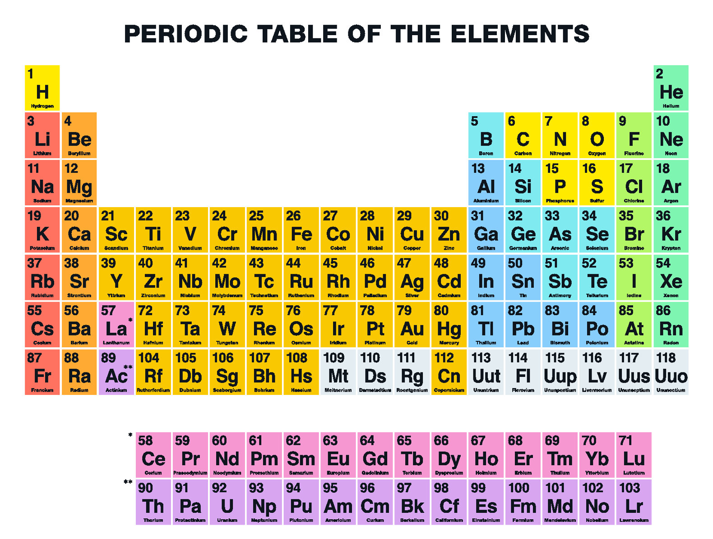

For our final project in ICS 314 we were tasked with creating a fully functional web application applying all the principles we had learned throughout the semester. Which at first seemed overwhelming, but once I got into the project I realized that overwhelming was a massive understatement. Applying all the principles you've learned over a very quickly paced course adds up rapidly. Especially because I had not worked with any of the languages involved in the project until this semester, nor had I ever used a framework. Combining the elements of git, javascript, meteor, CSS, HTML, IDPM, and the list goes on to the required knowledge to even breach the surface of what was necessary. This became a sink or swim scenario, so I did my best to do the latter. 

Initially the project did seem fairly simple. For the first task we were only required to create a mockup web page consisting of only elements of CSS and HTML. This did not take long, and the end result was moderately appealing, though rough around the edges. The next segment of the project proved to be much more challenging. This is where we had to integrate javascript into our project, more accurately where we had to integrate meteor into our project. This is where I realized that I was not nearly as good at Meteor as I though I had been. I was constantly getting lost within our project and breaking things with small changes. It was at this point that I realized that I needed to find a way to contribute in order to move the project forward. I spent many hours rewatching tutorial videos, both from what we learned in class, and what was available on the web. It was only then that I was able to understand the how meteor used the CRUD (create, read, update, delete) system in order to edit the values in our screen. By the time our project was over I felt competent in meteor. I am nowhere near mastering the framework, but I would be comfortable talking about the framework's pros and cons. 

After all the struggling though I feel that our project turned out very well. The core idea of our project was to create a web app that allowed University of Hawaii students to find adventures on the island that best fit them. Whether these adventures were beaches they had never been to, hikes they have yet to attempt, or simply restaurants that they were interested in trying. We aimed to give them an easy to navigate webpage to allow them to find these adventures. Users were able to create their own profile, create adventures they had done, choose which adventures they wanted to do next, "like" particular adventures, comment on each one, and view other profiles. Once an adventure was created an admin would approve or deny what the user had created. This was simply implemented to deter duplicate or inn
