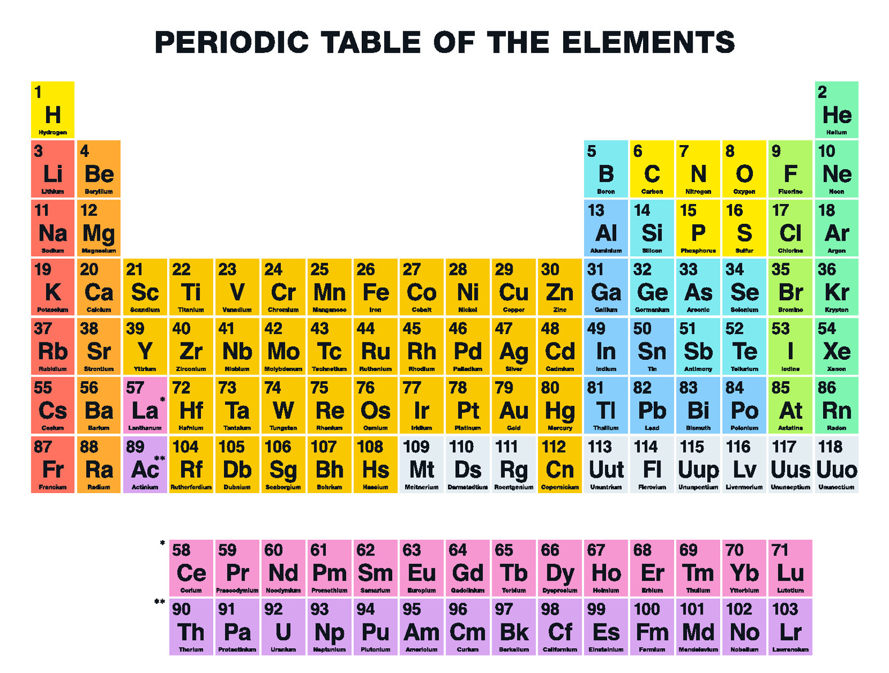

During the last few years of my chemistry degree, I undertook the responbility of being the President of the Chemistry Club. During this time I was in charge of several things such as increasing club membership, organizing events, connecting chemistry students among themselves, and creating a connection between faculty and undergraduates.

When I first took over the club in 2011 club membership was at an impressive two members, the president and the vice president. Over the course of the next 2 and a half years I was able to increase membership up to 30 members. This was done through the use of organizing events that interested students, doing announcements in chemistry courses, and by creating an enviroment where the small number of chemistry students (and those that were interested in chemistry) could collaborate and work together. 

Some of the events that were put together were school demonstrations, and faculty/grad student presentations. The school demonstrations were performed at Kaimuki High School, Manoa Elementary, and at the Experience Manoa festival. These events were very popular for our members that were interested in pursuing careers in education. The greatest part of these demonstrations was the amount of interest we were able to generate in the sciences. We performed experiments such as freezing objects in liquid nitrogen, making liquid nitrogen ice cream (vanilla flavored, of course), thermite reactions, and testing helium vs. sulfur hexaflouride (makes your voice very deep). Among the students in attendance a lot of them were able to see a side of chemistry that is not usually taught in schools, and for those in elementary it was a very interesting first look at the capabilities of chemistry. 

Another very popular event was our faculty/graduate student presentations. At the beginning of the semester students would read through the research being conducted within the chemistry department. From there each member would be asked what research areas interested them the most, and the corresponding professors/graduate students would be contacted. Upon the presentation day we would cater enough food to feed all that attended (typically around 25 people), and short 15 - 20 minute presentations would be conducted. This was an excellent way for our members to learn about graduate school, different areas of research, research techniques, and inquire about potential internships. 

From this experience I learned valuable skills in leadership, organization, and networking. I also faced many difficulties in those same categories. This was my first role where I was consistently put in a public speaking position. During the meetings I would only talk in front of around 30 students. During the announcements at the beginning of the year I would speak in front of aroudn 150 students. At first this made me nervous, but by the fifth announcement that fear had passed. Organizing events also proved to be very challenging balancing scheduling conflicts among myself, the board, members, and faculty. This proved especially true for the events that were held outside of school hours, or off campus. The networking opportunities provided were tremendous, members were able to better connect with the faculty. Several were even offered internships that they kept until graduation. We were also able to connect amongst other clubs at UH Manoa. Overall, it was a challening and beneficial learning experience.
